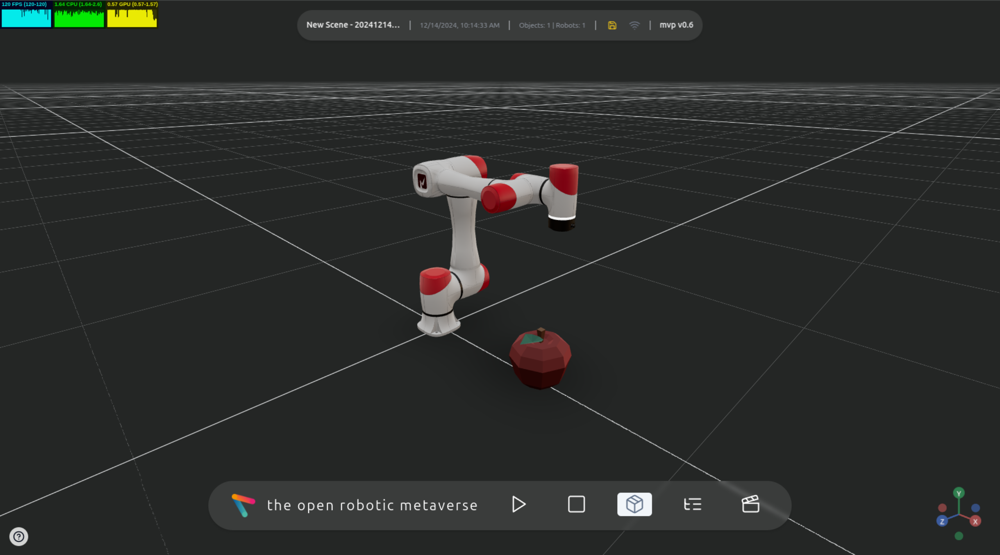

<p align="center">
  <a href="https://www.openroboticmetaverse.org">
    
  </a>
</p>

<h1 align="center">
  🤖 open robotic metaverse MVP - Robotics Platform 🌐
</h1>

> ### Development Branch 🚧
> This is the **development branch**, containing the latest version of the frontend for the platform.

[](https://app.netlify.com/sites/orom-mvp/deploys)


## Overview 🔍

The **open robotic metaverse MVP** is a browser-based platform designed to bring together robotic projects, empowering users to collaborate, share, and explore robotics projects.




## Key Features 🗝️

- **Interactive Robotic Control**: Engage with robots in real-time within a virtual environment. 🕹️  
- **Real-Time Observation**: Observe other users’ interactions with robots live. 👀  
- **Collaborative Engagement**: Multi-user support allows seamless collaboration across the metaverse. 👥  


## Technology Stack 🛠️

- **React TS**  
- **Tailwind CSS**  
- **React Three Fiber**  


## Setup ⚙️

### 1. Clone the Repository 📥

```bash
git clone https://github.com/openroboticmetaverse/mvp-webapp.git
cd mvp-webapp
git switch dev
```

### 2. Start with Docker Compose 🐳

Run the following command to start the development environment:  
```bash
docker compose up -d
```

### 3. Launch the Frontend 🖼️

Open a terminal in the frontend container:  
```bash
docker exec -it mvp_frontend bash
```

Inside the container, install dependencies and start the development server:  
```bash
yarn
yarn dev --host
```

Finally, open [http://localhost:5173](http://localhost:5173) in your browser to explore the MVP. 🎉


